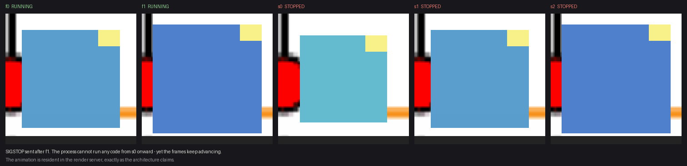
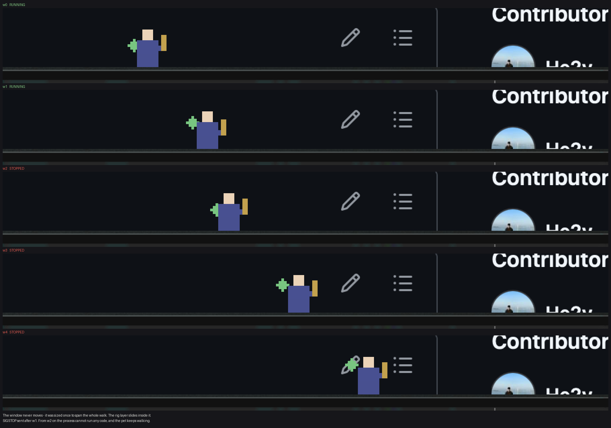

# Lodger

A macOS desktop companion: a small animated character that lives on screen, reacts to the
cursor, and idles quietly all day on battery.

The character is **not** part of this codebase. It lives in a *character pack* — a folder of
data — and the engine knows nothing about any particular one. Installing a character means
dropping in a folder.

## Status

Design, asset pipeline and engine core are in place. There is no shipping app yet, and the
reference character's art has not been drawn.

```bash
make test          # packtool: 17 negative tests proving each lint check fires
make engine-test   # engine: 103 self-tests, no Xcode needed
make all           # both, plus pack validation
make soak          # CPU soaks, repeated runs with the spread reported
```

Start with [`CLAUDE.md`](CLAUDE.md) — it carries the architecture and the reasoning.
[`Docs/PACK_FORMAT.md`](Docs/PACK_FORMAT.md) is the pack format for authors.

## The two rules

**The engine knows nothing about any character.** Sprite sizes, animation names, attachment
names, timing — all pack data. Delete every pack and the engine still builds and runs.

**Idle cost outranks features.** Sprite animation is a `CAKeyframeAnimation` on
`contentsRect` with `calculationMode = .discrete`, so it runs in the render server and the
app process does no per-frame work. This is verified, not assumed: sending `SIGSTOP` freezes
our code and the frames keep advancing.



A `quiescent` state installs no timer, no display link and no run-loop source at all. The
same idea extends to movement: a walk is resolved up front and handed to the render server
as one animation, so the pet keeps walking even while the process is frozen — 0.10% of one
core, down from 4.5% when the window was moved per frame.



## Layout

| | |
|---|---|
| `Engine/` | Swift package — no character data, no asset files |
| `Packs/klien/` | the reference character (manifest and art direction) |
| `Tools/packtool/` | the asset pipeline: `validate`, `palette`, `pixelize`, `anchors`, `build` |
| `Schema/pack.schema.json` | the normative pack manifest schema |
| `Docs/` | format spec, measurements, energy protocol |

## Licence

Engine: TBD. The `klien` character pack is licensed separately — see `Packs/klien/`.
